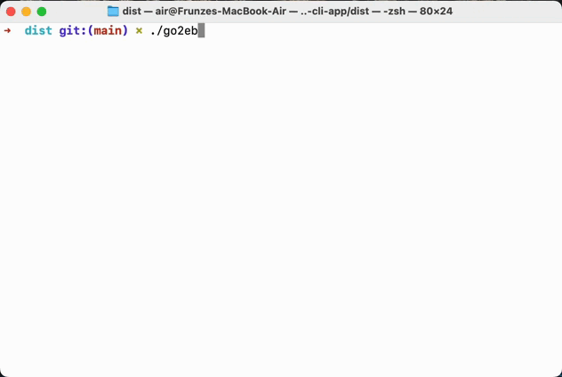

# sockets-use-cli-app
Command line app which can do the following things:
 
go2web -u <URL>         # makes an HTTP request to the specified URL and prints the response
 
go2web -s <search-term> # makes an HTTP request to search a term using Bing and prints top 10 results
 
go2web -h               # shows help

